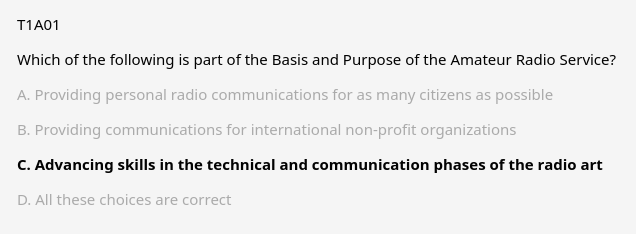

# Amateur radio licensing study decks

US amateur (ham) radio licensing exam study decks for Anki with highlighted correct answer choices for offline study, based on latest release



## Motivation

The National Conference of Volunteer Examiner Coordinators ([NCVEC](https://www.ncvec.org/)) releases, into the public domain, US amateur radio licensing exam single-answer multiple-choice question pools that are valid for a finite amount of time in PDF and docx formats and, from time to time, releases updates and corrections.

While some questions involve reasoning and calculation, a substantial portion of the pool involve facts/regulations, which are amenable to spaced repetition studying approaches, especially when there is a single correct answer choice.

Although the order of the answer choices can differ between the question pool and exam, the choice content is to remain the same. Accordingly, highlighted correct answers can with the studying process. (Determination of optimal identifiers for the correct answer based on other choices might be an exercise for the user.)

## Use

```
(venv) $ ls
20220307-ncvec-technician-exam.docx
20241108-ncvec-extra-exam.docx
20241108-ncvec-general-exam.docx
E5-1.png
E6-1.png
E6-2.png
E6-3.png
E7-1.png
E7-2.png
E7-3.png
E9-1.png
E9-2.png
E9-3.png
G7-1.png
README.md
T1.jpg
T2.jpg
T3.jpg
deck-maker.py

(venv) $ pip install python-docx==1.1.2 genanki==0.13.1

# load the latest docx files and images from ncvev.org site
# update input/output file names and figure mappings in deck-maker.py
(venv) $ python deck-maker.py
```
